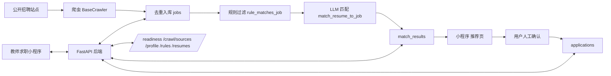

# 深圳教师求职小程序

一个面向深圳教师求职场景的微信小程序，全栈实现，支持岗位浏览、筛选、收藏、订阅、推荐、材料管理、投递确认和服务器状态查看。

## 技术栈

- 前端：微信小程序原生
- 后端：FastAPI
- ORM：SQLAlchemy 2.0
- 数据库：SQLite
- 匹配：规则过滤 + DeepSeek LLM
- 部署：云服务器 + systemd + timer

## 架构图



## 核心亮点

- 两层匹配管道：先用规则硬筛，再交给 LLM 做可解释评分。
- 合规边界明确：不做全自动投递，投递前必须用户确认。
- 简历改写强调反虚构，只允许重组和润色真实内容。
- 爬虫遵守 robots、限速和缓存，优先官方/可信来源。
- 开发模式可离线跑通，`LLM_STUB_MODE=1`、`EMBEDDING_STUB_MODE=1` 和 `EMAIL_STUB_MODE=1` 下仍能演示。
- 小程序前端有缓存兜底，断网不白屏。

## 本地运行

后端：

```bash
python3 -m venv .venv
.venv/bin/pip install -r requirements.txt
.venv/bin/uvicorn main:app --reload --port 8000
```

小程序：

```bash
cd miniprogram
node scripts/check-all.mjs
```

## 演示步骤

1. 打开 FastAPI `/docs`
2. 查看 `/readiness`
3. 打开小程序岗位页
4. 切换筛选条件、查看详情
5. 进入推荐页看匹配理由
6. 进入投递确认页，演示人工确认拦截

## 目录结构

```text
main.py        FastAPI 路由入口
services/      匹配、RAG、简历解析等服务层
miniprogram/   微信小程序页面、组件、工具函数、检查脚本
seed.py        本地演示数据初始化
README.md      项目总览
```

## 说明

- 当前仓库不包含 `.env`、数据库、用户上传材料和个人生成文件。
- 本地演示可使用 stub 模式跑通链路；如需真实 LLM / embedding，需要复制 `.env.example` 为 `.env` 后配置 DeepSeek 或智谱等 API Key。

## 下一步

- 接入真实 LLM 匹配
- 补充更多来源爬虫
- 增加更完整的 CI 和发布检查
- 继续完善演示和面试材料
