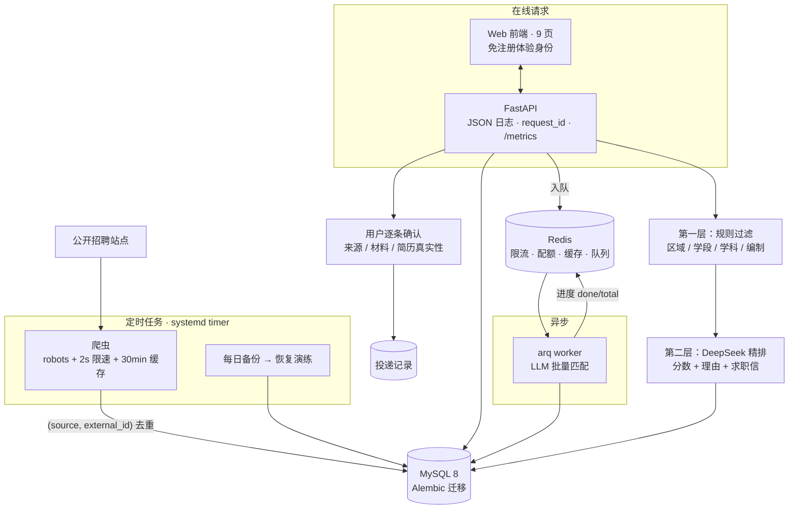
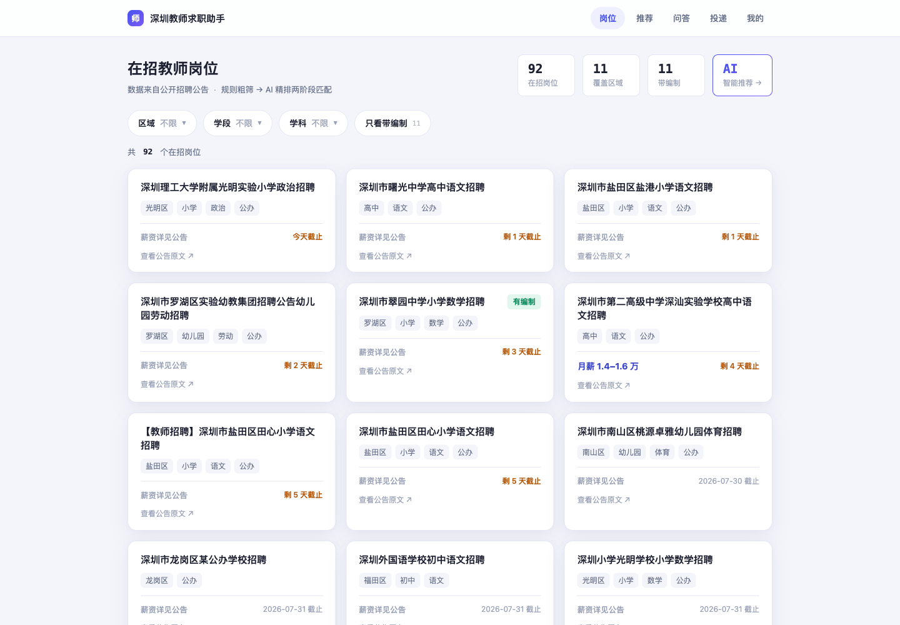
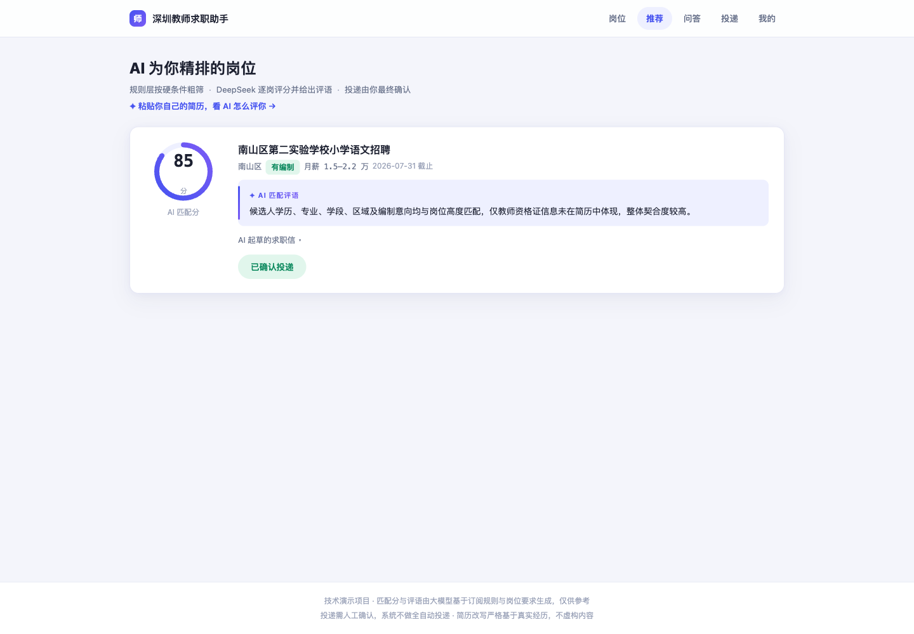
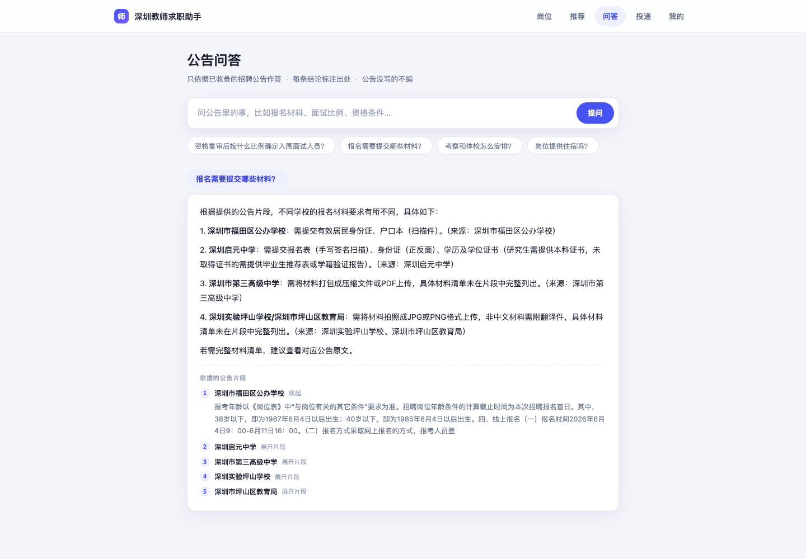
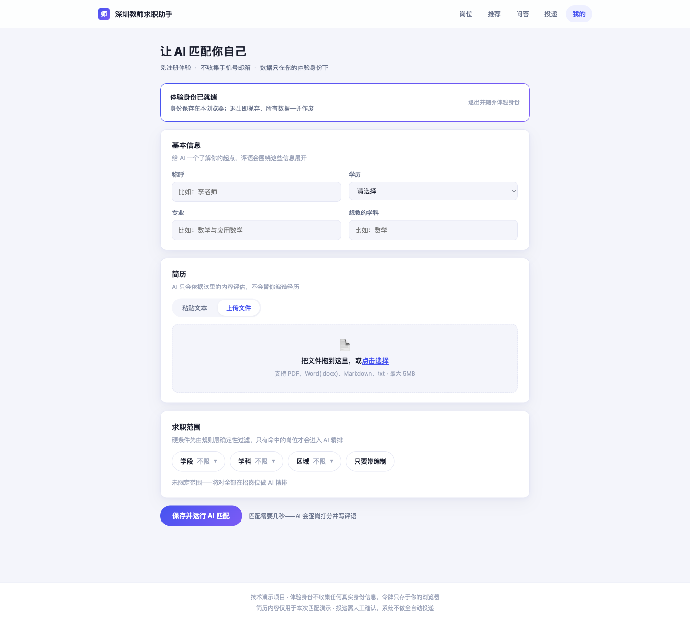

# 师途 · 深圳教师求职助手

[](https://github.com/Rhgic/teacher-job-finder/actions/workflows/ci.yml)

抓取深圳公开教师招聘岗位，用**规则粗筛 + LLM 精排**两层管道生成可解释推荐，
用户自带 DeepSeek Key，投递前逐条确认。

## 30 秒速览

|  |  |
|---|---|
| **是什么** | 全栈 Web 应用：爬虫 → 两层匹配管道 → 可解释推荐 → 公告 RAG 问答 → 辅助投递 |
| **技术栈** | FastAPI · SQLAlchemy 2.0 · MySQL 8 · Redis · arq · DeepSeek · Alembic · Docker |
| **规模** | 后端 6000 行 / 前端 3800 行 / **测试 3000 行 · 184 项** / 14 张表 / 5 个迁移 |
| **可复现** | 性能、RAG 召回、备份 RTO 全部有脚本可重跑，命令写在 README 里 |
| **安全** | 用户 API Key 服务端加密（Fernet），接口只回掩码，不进日志、不进任务载荷 |

**在线体验**：<http://42.194.146.44/>
（免注册；此机器上的版本落后于本仓库，最新界面请按[本地运行](#本地运行)跑）

> 定位：面试作品，不是运营中的招聘服务。刻意保留三条红线——不做全自动投递、
> 不编造简历内容、爬虫遵守 robots 与限速。这些约束在代码里是硬拦截，不是文档承诺。

---

## 最值得看的三件事

不是功能，是三个**所有自动化检查都通过、但东西实际是坏的**的问题。
它们不会让任何测试变红，只会让用户拿到错的结果。

### 1. 66% 的岗位学科标错了，而测试全绿

`_guess_subject` 在公告全文里按标准表顺序找第一个命中的学科名，
而「语文」恰好排在标准表第一位。于是「深圳中学招语文/数学/英语/物理/政治/科学教师」
整条被打成**语文**。全库回填统计：105 个岗位里 **69 个是错标的**。

后果不是标签难看：数学老师筛「数学」只有 5 条，那 28 条「语文」里一大批其实也招数学，
他一条都看不到。修复后 数学 5→27、英语 3→22、物理 3→22。

修法：承认「一个公告可以招多个学科」，加 `subjects` 字段（竖线包裹便于 SQL `LIKE` 筛选，
且首尾带竖线防止筛「科学」命中「信息科学技术」）。单值改为**只在恰好命中一个时才给值**——
多学科时置空，因为错标签比没标签更有害。

### 2. 主页面的登录态从未生效，被开发模式掩盖了

主页面读 `localStorage` 的 `tf_token`，而登录流程写的是 `tjf_session_token`。
全站搜索，`tf_token` **只有一处读、没有任何地方写**——所以主页面的 token 永远是 `null`，
从不发认证头。

本地看不出来，因为 `AUTH_DEV_MODE=1` 时后端会回落到 demo 用户，数据照常出来。
生产环境会让推荐、问答、投递三个页签一起 401：在「我的」页登录完，回主页面依然是未登录。

### 3. README 里的性能数字，没有产出它的脚本

原先写着「128 并发 QPS 257、零错误、P50 483ms」。全仓库 grep，
`scripts/` 下没有任何压测脚本，这个数字复跑不出来。

补了 `scripts/bench_api.py` 重测后发现真实问题在别处：`_engine_kwargs()` 对 SQLite 分支
直接 `return`，跳过了 `pool_size / max_overflow / pool_timeout`，落到 SQLAlchemy 默认池
（timeout **30 秒**）。也就是说「等待超时压到 5 秒、快速失败」这条设计
**在默认开发路径上从未生效**。修复前 56 并发 P50 30.0 秒，修复后 110ms。

定位方法是四层探针逐层加一个变量（async 无库 / sync 无库 / sync+SELECT 1 / 完整查询），
四层都不塌，才把范围收敛到池配置本身——而不是一上来就归因给「数据库慢」。

> 补一句：我为替换那个数字所写的**第一版压测结果同样是错的**——
> 当时压测打的端口上已经有另一个 `--reload` 服务在监听，就绪探测被它骗过。
> 这段经过和结论都保留在 README 的[压测基线](#压测基线)里，没有抹掉。

---

## 这个项目想证明什么

不是"我会调大模型 API"。真正花力气的是**在成本、可靠性和真实性之间做取舍，并且用数字说话**：

| 问题 | 做法 | 实测结果 |
|---|---|---|
| LLM 按次付费，怎么不被刷爆 | 规则层先筛掉不可能的岗位，只把候选交给模型；再叠加 IP 限流 / 单人日配额 / 全局熔断 / 结果缓存 | 相同输入第二次**完全不发网络请求**（`test_cache_hit_skips_network` 守着调用计数），即零 token 费用 |
| 护栏本身挂了怎么办 | **降级优先于保护**：Redis 连不上时放行并告警，而不是拒绝服务 | 停掉 Redis 后 `/health` `/jobs` `/rag/ask` `/metrics` 全部照常 200 |
| RAG 会不会一本正经胡说 | 检索不到就短路，不进模型 | 评测集 **20 答得出 + 4 答不出**：拒答 4/4；查询扩展把召回从 19/20 提到 20/20 而拒答不变。样本小，只当回归基线看 |
| 高并发下会怎么死 | 四层探针逐层加变量排除 Web 栈 / 线程池 / 连接获取 / 序列化，定位到**连接池参数在 SQLite 分支被跳过**；过载统一返回 **503 + Retry-After** 而非 500 或卡死 | 见下方[压测基线](#压测基线)：修复前 56 并发 P50 **30.0 秒**、QPS 3.7；修复后 P50 **110ms**、QPS 343，128 并发过载改为在 **5.1 秒**精确快速失败 |
| 备份到底能不能恢复 | 写了恢复演练脚本，真的恢复到临时库并逐表比对 | **RTO 1.3 秒**，11 张表全到；同时诚实记录 **RPO = 24 小时**是短板 |
| 用户点一次匹配要等几十秒 | 改为 arq 异步队列 + 进度轮询；队列不可用时退回同步执行 | 点击即返回任务 ID，前端显示「已评 37/91 个岗位」 |

每一条背后的推理都写在对应文件的注释和 commit message 里，不是事后补的说明。

---

## 架构



**两层管道是成本控制的核心**：规则层是确定性 SQL，零成本地砍掉大部分岗位；
只有可能匹配的才进模型。这不是性能优化，是让这个项目在真实 API 计费下跑得起来的前提。

---

## 界面

岗位页把区域、学段、学科与编制收进筛选条，卡片集中展示薪资、截止时间与公告原文入口。



推荐页用"成绩单"式卡片呈现匹配分、评语与确认状态，让两阶段匹配的结果可被解释。



公告问答只依据已收录内容作答，并可展开查看实际命中的公告片段。



「我的」页支持粘贴或上传简历，用学段、学科、区域、编制圈定求职范围。



---

## 技术栈

| 层 | 选型 | 说明 |
|---|---|---|
| 前端 | 原生 HTML/CSS/JS，9 个页面 | 由后端 StaticFiles 同源托管，无构建步骤、无 CORS |
| 后端 | FastAPI + SQLAlchemy 2.0 + Pydantic v2 | `routers/` 与 `services/` 分层 |
| 数据库 | MySQL 8（utf8mb4）+ Alembic 迁移 | CI 有模型漂移检测；可切 SQLite 供单测 |
| 缓存/队列 | Redis 7 | 限流、日配额、LLM 结果缓存、arq 任务队列 |
| AI | DeepSeek（OpenAI 兼容） | `LLM_STUB_MODE=1` 时无需密钥即可端到端演示 |
| 爬虫 | httpx + 自研 `BaseCrawler` | robots、限速、缓存、去重做成基类能力 |
| 可观测 | JSON 结构化日志 + `request_id` 全链路 + `/metrics` | 含 LLM 调用数与 token 消耗 |
| 部署 | 云服务器 + systemd（API/worker/爬虫/备份）+ Nginx | |
| 质量 | pytest 184 项 + ruff + GitHub Actions | 含 38 项穿过完整栈的接口测试与邮箱/Key 安全测试 |

> 仓库里的 `miniprogram/` 是早期的小程序版本，已不是主线，保留作演进记录。

---

## 本地运行

```bash
cd backend
python3 -m venv .venv
.venv/bin/pip install -r requirements.txt
docker compose up -d          # MySQL + Redis
export APP_ENCRYPTION_KEY="$(.venv/bin/python -c 'from cryptography.fernet import Fernet; print(Fernet.generate_key().decode())')"
.venv/bin/alembic upgrade head
.venv/bin/python seed.py
.venv/bin/uvicorn main:app --reload --port 8000
```

打开 <http://127.0.0.1:8000/> 即是 Web 前端。默认 `LLM_STUB_MODE=1`、
`MAILER_DRY_RUN=1`、`AUTH_DEV_MODE=1`；无需平台模型 Key，但必须设置
`APP_ENCRYPTION_KEY`，以便安全保存用户自行配置的 DeepSeek Key。

异步匹配需要另起 worker（不起也能用，会自动退回同步执行）：

```bash
cd backend && .venv/bin/arq services.tasks.WorkerSettings
```

## 测试与评测

```bash
cd backend
.venv/bin/python -m pytest              # 184 项
.venv/bin/ruff check .
.venv/bin/python scripts/eval_rag.py    # RAG 检索质量基线，出数字
.venv/bin/python scripts/verify_backup_restore.py   # 备份恢复演练
.venv/bin/python scripts/bench_api.py   # 接口压测基线，出数字（需服务已启动）
```

测试分两类：`test_api_endpoints.py`（38 项）走真实 HTTP 穿过路由、鉴权、序列化、
异常处理器；其余测纯函数逻辑。**接口层此前零覆盖，改坏了只能靠手工点页面才发现。**

### 压测基线

先起服务，再在另一个终端跑脚本：

```bash
.venv/bin/uvicorn main:app --port 8000 --env-file .env
.venv/bin/python scripts/bench_api.py --concurrency 128 --per-worker 2
.venv/bin/python scripts/bench_api.py --path /health --concurrency 128 --per-worker 2
```

**实测环境**：2026-08-10 · macOS 26.5.2 arm64 / 18 CPU · **Python 3.12.13**（对齐
`backend/Dockerfile` 的 `python:3.12-slim`）· 单 uvicorn worker、无 `--reload` ·
压测客户端与服务端同机 · 目标接口 `/jobs?size=20`。

#### MySQL 路径（`--env-file .env`，池 20+30 / timeout 5s，库里 100 个岗位）

| 并发 | 总请求 | 成功 | 503 | QPS | P50 |
|---|---|---|---|---|---|
| 32 | 64 | 64 | 0 | 331.0 | 79.8ms |
| 48 | 96 | 96 | 0 | 360.6 | 100.0ms |
| 56 | 112 | 112 | 0 | 289.9 | 126.0ms |
| 64 | 128 | 128 | 0 | 268.9 | 162.7ms |
| 128 | 256 | 216 | 40 | 38.0 | **5088.6ms** |

128 并发时连接池（容量 50）确实被打满，超出的请求在 **5.09 秒**拿到
503 + `Retry-After` —— 与配置的 `pool_timeout=5` 精确吻合，这正是
"快速失败而非慢性死亡"想要的形状。

#### SQLite 默认开发路径（不带 `DATABASE_URL`，即上面「本地运行」那条命令）

这条路径曾经有一个 bug，修复前后对比（同机、同脚本、同参数）：

| 并发 | 修复前 QPS | 修复前 P50 | 修复后 QPS | 修复后 P50 |
|---|---|---|---|---|
| 48 | 384.3 | 93.4ms | 294.3 | 122.7ms |
| 56 | **3.7** | **30037ms** | **343.4** | **109.9ms** |
| 64 | **4.2** | **30051ms** | **307.2** | **132.3ms** |
| 128 | 3.2（0 成功，216 个客户端超时） | 40041ms | 36.6（216 成功） | **5123.8ms** |

**根因不是数据库慢，是连接池参数没传进去。** `database.py` 的 `_engine_kwargs()`
原先对 SQLite 直接 `return {"connect_args": ...}`，注释理由是"SQLite 是本地文件，
没有网络连接池语义"。但文件型 SQLite 在 SQLAlchemy 里照样走 QueuePool，
跳过这几个参数不等于"没有池"，而是**落到 SQLAlchemy 的默认池**：
`pool_size=5, max_overflow=10, pool_timeout=30`。于是容量只有 15、
过载要挂满 30 秒 —— 那句"等待超时压到 5 秒"在默认开发路径上从未生效。

#### 定位过程：逐层加变量

用一个只有四个探针的旁路 app（复用产品的 engine 与中间件）把请求拆开，
每层只多一个变量，避免一上来就归因给数据库：

| 探针 | 128 并发结果 |
|---|---|
| `async` 路由，不碰库 | 256/256 成功 |
| `sync` 路由，不碰库 | 256/256 成功 |
| `sync` + `SELECT 1` | 64 并发 QPS 299，checkout p50 0.9ms / SQL p50 1.6ms |
| 完整 `/jobs` 逻辑 | 64 并发 QPS 315，query p50 25.9ms / 序列化 p50 0.0ms |

四层都不塌 —— 说明 Web 栈、线程池（anyio 默认 40）、连接获取、SQL、序列化
全都不是瓶颈，问题只可能出在**池的配置**上。这个排除过程比结论更值得看。

> **两条写在这里的教训。**
> 其一，README 最早写的「128 并发 QPS 257、零错误、P50 483ms」没有对应脚本，
> 复跑不出来，已删除。
> 其二，2026-08-09 补的第一版替代表格**同样是错的**：当时压测打的端口上
> 已经有一个别的 `--reload` 开发服务器在监听，就绪探测被它骗过，
> 于是"测到"了一个不存在的容量塌陷，还据此写下"瓶颈在数据库路径"。
> **压测前先确认打的是不是自己刚起的那个进程**——否则测的是别人。

## 目录

```text
backend/
  main.py            FastAPI 入口（含 503 过载处理、静态前端挂载）
  routers/           岗位、推荐、投递、档案、规则、爬虫、问答、状态
  services/          规则过滤、LLM 匹配、爬虫、简历改写、RAG、限流、任务队列
  web/               Web 前端（9 页 + assets）
  tests/             pytest（184 项，含 38 项接口级）
  scripts/           RAG 评测、压测、备份、恢复演练、定时抓取、上线检查
  migrations/        Alembic 迁移
  deploy/            systemd / Nginx 模板
docs/screenshots/    界面截图
miniprogram/         早期小程序版本（非主线）
```

详细的后端说明见 [backend/README.md](backend/README.md)，部署与故障恢复见
[backend/DEPLOYMENT.md](backend/DEPLOYMENT.md)。

---

## 合规边界

- 投递必须用户逐条确认，**不做全自动投递**。
- 简历改写只能重组、突出、润色**真实内容**，严禁编造学历、证书、经历、年限或技能；
  产出可核对的改动清单，草稿经审核才可投递。
- 爬虫优先官方来源，遵守 robots、限速与缓存；招聘方邮箱按个人信息谨慎处理。
- 后台接口 `/crawl/run`、`/pipeline/run` 在正式模式下需要 `X-Admin-Token`。

## 已知边界

写在这里是因为这些是清楚的取舍，不是没想到的疏漏：

- **RPO 24 小时**。每天备份一次，最坏丢一天数据。岗位可重爬，投递记录与简历不可再生；
  真要压低需要 binlog 增量备份或主从，当前规模下不值得。
- **单实例**。`/metrics` 的请求计数在进程内存里，多副本时各报各的数，
  需要改用 Redis 或 Prometheus 多进程模式才能汇总。连接池按单实例占 50 连接配置，
  并排跑超过 3 个实例要先调大 MySQL 的 `max_connections`。
- **RAG 未用向量检索**。DeepSeek 不提供 embedding 模型，改用查询扩展 + 词法打分；
  自建评测集 20 题上召回 20/20，接真实 embedding 是增强而非补漏。
  但 20 题这个样本量只够当回归基线，不足以支撑"检索质量好"的结论。
- **`/metrics` 目前公网可直接访问**，没有鉴权。里面只有请求计数与 token 用量、
  不含业务数据，但会暴露路由清单与流量规模，正式对外应放到 Nginx 的
  内网白名单或加 Basic Auth 后面。
- **IP-only HTTP**，未备案故无域名与 HTTPS。
- 简历 PDF 结构化抽取仅覆盖常见排版；COS 上传留了接口未接密钥。
