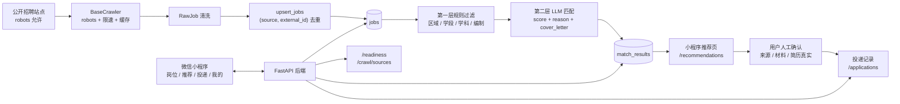

# 深圳教师求职小程序

一个面向深圳教师求职场景的全栈作品集项目：微信小程序前端 + FastAPI 后端，自动抓取公开教师招聘岗位，用规则过滤 + LLM 匹配生成可解释推荐，并在用户人工确认后辅助记录投递。

> 定位：这是用于面试演示和代码讲解的作品，不是公开上线运营的招聘服务。项目刻意保留合规边界：不做全自动投递，不编造简历内容，爬虫遵守 robots / 限速 / 缓存。

## 功能概览

- 岗位浏览：深圳教师岗位列表、关键词搜索、区域/学段/学科/编制筛选。
- 推荐队列：根据订阅规则和求职档案展示匹配岗位、分数和推荐理由。
- 投递确认：投递前必须核对公告来源、材料、简历真实性；已截止岗位前后端都会拦截。
- 求职工作台：简历中心、求职档案、收藏岗位、岗位订阅、材料清单、提醒中心、求职日历。
- 来源核验：展示公告来源、邮箱、截止日期和投递前风险提示。
- 运维可观测：`/readiness` 展示非敏感上线准备状态、岗位数、活跃规则数和备份状态。

## 技术栈

| 层 | 选型 |
|---|---|
| 前端 | 微信小程序原生 |
| 后端 | FastAPI + SQLAlchemy 2.0 + Pydantic v2 |
| 数据库 | MySQL 8（utf8mb4，连接池 pre_ping/recycle）；`DATABASE_URL` 可切回 SQLite 供本地与单测使用 |
| AI 匹配 | DeepSeek OpenAI 兼容接口；默认 `LLM_STUB_MODE=1` 占位可演示 |
| 爬虫 | httpx + 自研 `BaseCrawler`（robots、限速、缓存、去重） |
| 部署 | 云服务器 + systemd service/timer + Nginx 模板 |
| 测试 | pytest + 小程序 Node 静态检查/断言脚本 |

## 架构图



## 核心亮点

1. **两层匹配管道**
   `services/pipeline.py` 先用规则过滤硬条件，只把可能匹配的岗位交给 LLM，降低成本和延迟；`rule × job` 幂等，重复运行不会重复写入。

2. **可解释 AI 匹配 + 反虚构约束**
   `services/llm_match.py` 要求输出结构化 JSON：分数、命中点、差距、推荐理由和求职信草稿。解析失败会重试并兜底为 `score=None`，不让单条模型异常拖垮整批任务。

3. **合规爬虫基类**
   `services/crawler.py` 把 robots 校验、2 秒礼貌限速、30 分钟缓存、自定义 UA、敏感路径避让做成基类能力。入库用 `(source, external_id)` 去重，字段变化时更新旧记录。

4. **三层防误投**
   小程序列表标记已截止岗位，详情页阻止进入正常投递确认；后端 `POST /applications` 对已截止岗位返回 `400`，不写记录、不发邮件。

5. **开发/演示友好的开关**
   默认 `LLM_STUB_MODE=1`、`MAILER_DRY_RUN=1`、`AUTH_DEV_MODE=1`，没有外部密钥也能端到端演示；真实上线再切换环境变量。

6. **前端本地兜底**
   小程序请求失败时回退本地缓存或 fallback 数据，收藏、订阅、材料清单、投递跟进等采用“本地立即生效 + 后台同步”的方式，避免断网白屏。

## 本地运行

后端：

```bash
cd backend
python3 -m venv .venv
.venv/bin/pip install -r requirements.txt
.venv/bin/python seed.py
.venv/bin/uvicorn main:app --reload --port 8000
```

小程序：

```bash
cd miniprogram
node scripts/check-all.mjs
```

微信开发者工具打开 `miniprogram/`，本地设置勾选“不校验合法域名”。开发环境 API 已指向 `http://127.0.0.1:8000`。

## 测试与自检

后端单元测试：

```bash
cd backend
.venv/bin/python -m pytest
```

小程序检查：

```bash
cd miniprogram
node scripts/check-all.mjs
node scripts/test-build-job-title.mjs
```

演示前自检：

```bash
python3 演示前自检.py
```

当前测试覆盖重点：

- `rule_matches_job`：规则过滤命中/拒绝。
- `content_hash`、`upsert_jobs`：岗位去重和更新。
- `make_token`、`verify_token`：HMAC 会话令牌签发与篡改拒绝。
- `_extract_json`、`_normalize`：LLM JSON 解析和分数裁剪。
- `buildJobTitle`：避免“华附乐城小学小学语文招聘”这类标题重复。

## 演示路径

1. 打开 FastAPI `/docs`，展示接口文档。
2. 调 `/readiness`，说明上线准备、岗位数和备份状态可观测。
3. 打开小程序岗位页，演示搜索、筛选、当前可投/含已截止。
4. 进入岗位详情，展示来源核验、已截止拦截、收藏和订阅类似。
5. 进入推荐页，讲规则过滤 + LLM 匹配理由。
6. 进入投递确认页，演示三项确认和“不自动投递”的产品红线。

## 目录结构

```text
backend/
  main.py                 FastAPI 入口
  routers/                岗位、推荐、投递、档案、规则、爬虫、状态等路由
  services/               规则过滤、LLM 匹配、爬虫、简历改写、发信、登录
  tests/                  pytest 单元测试
  scripts/                上线检查、备份、定时抓取、发布包等脚本
  deploy/                 systemd / Nginx 部署模板

miniprogram/
  pages/                  微信小程序页面
  components/job-card/    岗位/推荐卡片组件
  utils/                  API、缓存同步、来源核验工具
  scripts/                静态检查、发布检查、标题断言

面试讲解.md               面试讲解脚本和追问答法
给Codex的方案_面试打磨.md  面试打磨任务清单
演示前自检.py             零依赖演示检查脚本
```

## 合规边界

- 投递必须由用户人工确认；系统不做全自动投递。
- 简历改写只能重组和润色用户真实内容，严禁编造学历、证书、经历、年限或技能。
- 爬虫优先可信来源，遵守 robots、限速、缓存；招聘邮箱按敏感信息谨慎处理。
- 后台任务接口 `/crawl/run`、`/pipeline/run` 在正式模式下需要 `X-Admin-Token`。

## 下一步

- T1：根据微信开发者工具 Console 清单清掉演示时的 error/warning。
- T4：提供 DeepSeek API Key 后切到真实 LLM 匹配，验证真实分数和推荐理由。
- T5：继续小范围 UI 收尾，只打磨主链路页面。
- 后续增强：令牌过期/刷新、CI、更多合规来源、匹配效果评估集、数据库迁移到 PostgreSQL。
