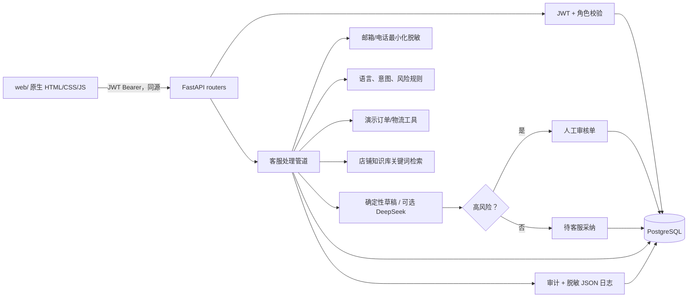

# V1 架构

## 数据模型与隔离

`tenants` 是根对象。`users`、`orders`、`knowledge_articles`、`conversations`、`messages`、`drafts`、`review_tasks`、`audit_logs` 都保存 `tenant_id`。会话、订单、知识库和审核单查询均从认证用户的租户条件起手；跨租户对象返回 404，避免泄露对象是否存在。

密码只保存 bcrypt 哈希。消息在写库前将邮箱和电话替换为占位符。草稿保存知识条目 ID 引用；审计元数据是白名单结构化字段，不能写正文、密码或 token。

## 请求数据流

`POST /api/conversations/{id}/messages` 先验证 JWT 和会话租户，再执行：脱敏 → 语言/意图 → 风险 → 只读演示数据库工具 → 最多三条知识库检索 → 草稿 → 二次风险检查 → 写消息、草稿、审核单（如需要）和审计。接口提交同一个事务，刷新和重新请求仍能读到记录。

草稿缺少政策依据时只会请求人工确认或补充订单信息，不能编造政策。DeepSeek 仅在配置 Key 时调用，使用 `httpx.AsyncClient`、连接/总超时和固定工具参数白名单；第三方异常只记录错误类型，然后回退确定性草稿。

## 风险路由

| 命中类型 | 路由 | 系统动作 |
| --- | --- | --- |
| 退款、赔付、结算、支付、地址修改 | 人工审核 | 创建 `review_tasks`，草稿标记 `blocked`，不允许客服采纳 |
| 物流、优惠、一般咨询且有政策依据 | 客服待采纳 | 创建 `pending_agent` 草稿及引用 |
| 无政策命中 | 安全草稿 | 请求人工确认/更多信息，不作政策承诺 |

管理员审批也只是记录“通过/驳回、理由、操作人和时间”。它不触发退款、赔付、地址写入或外部消息。

## 为什么 V1 不使用 LangGraph、Milvus、Redis

处理链是固定顺序的同步路径，没有循环、分支编排恢复或长期记忆需求，因此普通服务函数比 LangGraph 更容易逐文件讲清和单测。店铺政策规模很小，关键词检索足以提供可解释引用，引入 Milvus 和 embedding 服务只会增加运行依赖。没有异步任务、重试/死信或高吞吐目标，Redis 队列属于 V2 真实平台接入后的需求，不是本 MVP 的必要组件。
